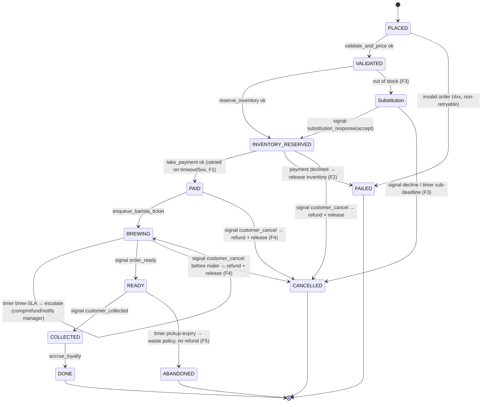

# Order-Ahead workflow — state diagram

The `OrderWorkflow` is the single source of truth for an order. Solid arrows are
activity-driven transitions; `signal:` arrows are external events; `timer:` arrows are
elapsed timers. Terminal states are `DONE`, `FAILED`, `CANCELLED`, `ABANDONED`.

Notes:
- **Cancellation policy.** A `customer_cancel` is honored up to the moment the drinks are
  made (`BREWING` → `CANCELLED`, with refund + inventory release). Once `READY`, the cancel
  is ignored — the drinks already exist — and the order proceeds to collection or expiry.
- **Substitution / F3** happens at the inventory step, *before* any charge, so a declined
  or timed-out substitution cancels with nothing to refund.
- **Brew-SLA** is an escalation, not a state change: it self-loops on `BREWING`, notifies a
  manager, then keeps waiting for `order_ready` / `customer_cancel`.
